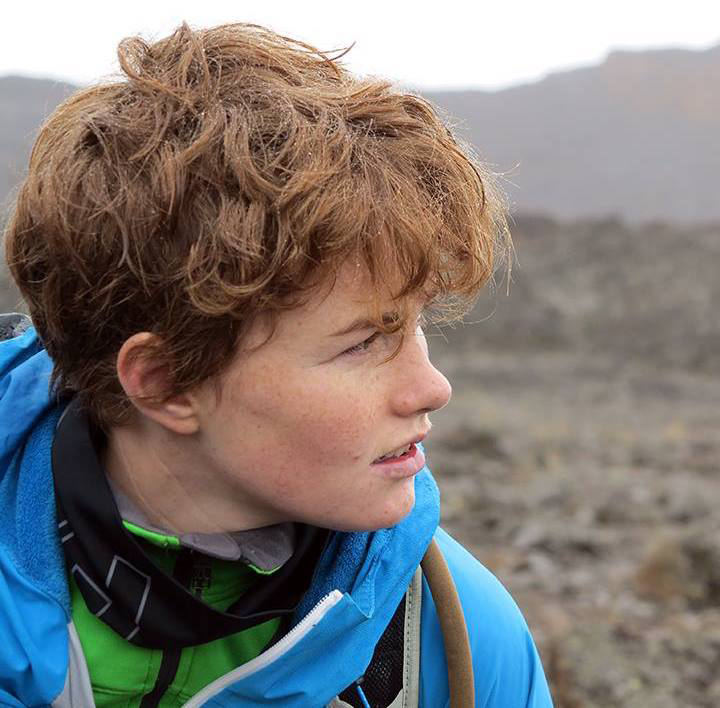

As a child my imagination was totally captured by the outside world - people either bored or intimidated me. Growing up in (almost always sunny) South Africa where year round outdoor exploring is very much the order of business only helped re-enforce this. As I grew older the idea of working in a 'normal' job was possibly the most unappealing idea - mostly because even now I don't actually know what a 'normal' job entails and at this point I'm too afraid to ask. I knew one thing though and that was that future Tanya needed to work with the natural world in some capacity and not need to have an office mandated dress code. Biology was the natural direction to go into and I can still recall the exact first year botany lecture in which I decided that ecology was what got me _really_ excited. Specifically interactions between species and then just getting absolutely blown away thinking about all the layers that there was to this.

I was fortunate to have had the opportunity to do my Masters abroad in cold, dark (NEVER sunny) Sweden. But let me tell you I missed home, Africa home that is, A LOT, although I did learn a lot and I _think_ it is also what precipitated the (dare I say it) audacity of me to apply for a PhD program in Canada (even further from home but hopefully a bit more sunny). The decision to study far from home is something that, to this day, I think about a lot. There are a whole host of thoughts that run through my head regarding this. One of them is that I think its easy to fall into this idea that the grass is greener at some institutions/countries and that it gives you a chance to sit at the 'cool kids' table. There is probably some truth to this but having to leave the place that that moulded and shaped me into the scientist I am now in order to further my training to become a 'better' scientist doesn't always sit well with me.

I wish there was an easy fix for my probably very idealistic dream. A dream in which we do not have this idealisation of some institutes/countries or this idea that we need to be there to make it to the cool kids table. Ideally we would all be sitting at the same big table and we could just switch seats as we needed depending on who we wanted to talk to. In that way we would all feel part of the global science community and that our work also has a place there ( _i.e._ we feel like we can and should voice our thoughts) all while still being able to stay in the place that we feel is home. Alternatively if you do choose to study or work abroad is not because it is a better career move but rather an opportunity to broaden your own knowledge base.

 

--- 
