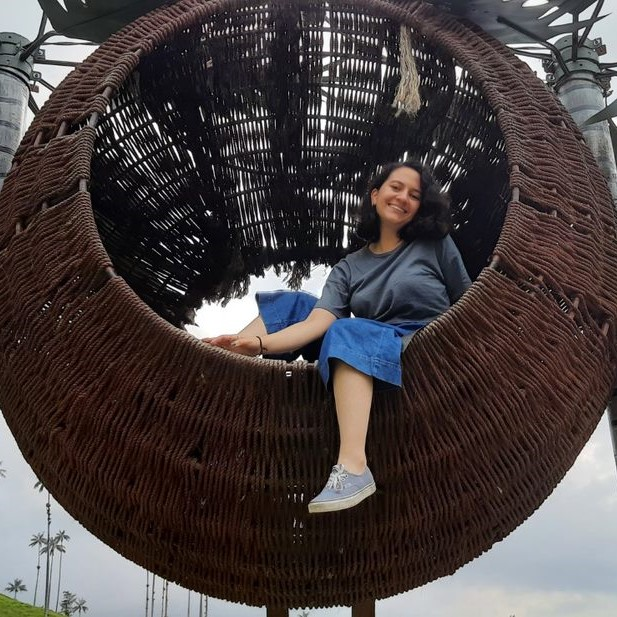

Soy una colombiana que está preparándose para ser ecóloga de enfermedades. Un camino que se ha forjado desde la pasión y la perseverancia. Tuve la fortuna de crecer en una familia con una alta sensibilidad por el bienestar de los animales y el medio ambiente; cuando era niña, encontraba motivante los programas de televisión y las revistas con historias de animales silvestres, además de explorar el mundo de los insectos entre plantas y rocas. Todo esto era posible por estar en un hogar en el que se reconocía la importancia de todos de los organismos vivos, ya fuese una bacteria microscópica o una inmensa ballena azul. 

Al momento de elegir mi camino profesional, decidí convertirme en médica veterinaria pensando en contribuir directamente a la cálida de vida de los animales, especialmente en aquellos lugares donde las actividades humanas pusieran en riesgo su integridad. A través de mis estudios, conocí más a fondo sobre 

Microbiología y transmisión de enfermedades. Durante una de las prácticas en un laboratorio de patología veterinaria, desarrolle mi tesis sobre la filogenia de un virus que afecta a individuos del orden carnívora. Fue maravilloso porque adicional al aprendizaje sobre las interacciones virus-hospedero, también desarrolle mis habilidades investigativas con el apoyo de una científica integral que me inspiro a continuar el camino de la academia. Aproximándome al grado, fui asistente en un congreso de medicina veterinaria de fauna silvestre. Recuerdo que dos proyectos me interesaron mucho: modelos matemáticos para entender el comportamiento de virus en roedores y avances en microbiología aplicada a animales de vida libre. Esto me llevo a buscar opciones para poder continuar mi formación académica, a pesar de las limitaciones económicas para financiar estudios de posgrado por mí cuenta. 

Mientras trabajaba en una clínica de caninos y felinos, logré participar como medica veterinaria en un proyecto que estudiaba la transmisión de un parásito de importancia para la salud humana, entre reservorios domésticos y silvestres. Posteriormente, obtuve financiación para cursar un programa de maestría en ingeniería biomédica, en la línea de biología matemática y computacional. Este fue el primer acercamiento al estudio cuantitativo de las dinámicas biológicas. Fue retador, dado que es una disciplina que estaba fuera de mí área de conocimiento. Recuerdo que, al iniciar las salidas de campo, no consideraba mi vida profesional sin la interacción directa con los animales y el análisis de muestras biológicas en el laboratorio. Nunca me imaginé que mi pasión por la ecología de las enfermedades me llevaría a apreciar tanto el abordaje cuantitativo teórico, lo que me incentivo a continuar mi formación a nivel doctoral en el campo de ecología computacional. Actualmente, tengo la suerte de pertenecer a un laboratorio conformado por un equipo excepcional que contribuye a mi crecimiento científico, como en su momento lo hicieron mi familia y profesores.