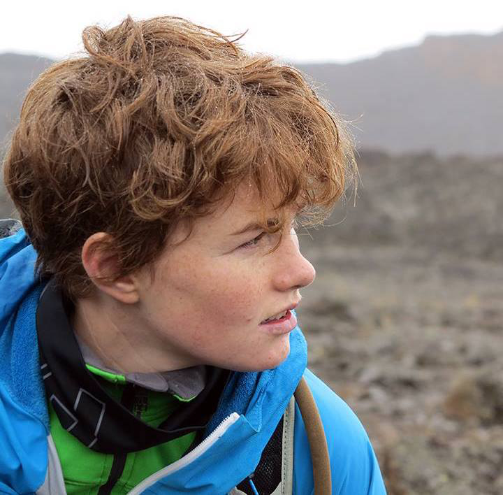

Gracielle Higino
STORY
SOCIAL LINKS - MAKE IT STALKABLE!!!!!!!!!!!!!!!11111

 

--- 

Mickey Boakye
STORY
SOCIAL LINKS - MAKE IT STALKABLE!!!!!!!!!!!!!!!11111

 

---

Norma Rocio Forero-Muñoz
STORY
SOCIAL LINKS - MAKE IT STALKABLE!!!!!!!!!!!!!!!11111

 

---

Tanya Strydom

A code switching (both spoken and programmatic) scientist in training with an artistic alter-ego,and avid warm beverage fan who loves playing outside in the mountains and wants to understand why communities are structured the way that they are. Being the maths ~~geek~~ nerd that I am my PhD has taken on a distinctly computational flavour and aims to help us improve our understanding and ability to make more global generalisations about ecological networks. Current interests include (but are not limited to): ecological networks, species traits, the role of scale and how all that fits together as a member of the amazing (if you ask me) Poisot Lab along with a (seemingly) ever growing list of side projects.

Add a bit more about my journay from SA to here...

SOCIAL LINKS: @TanyaS_08 (twitter)

 